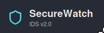
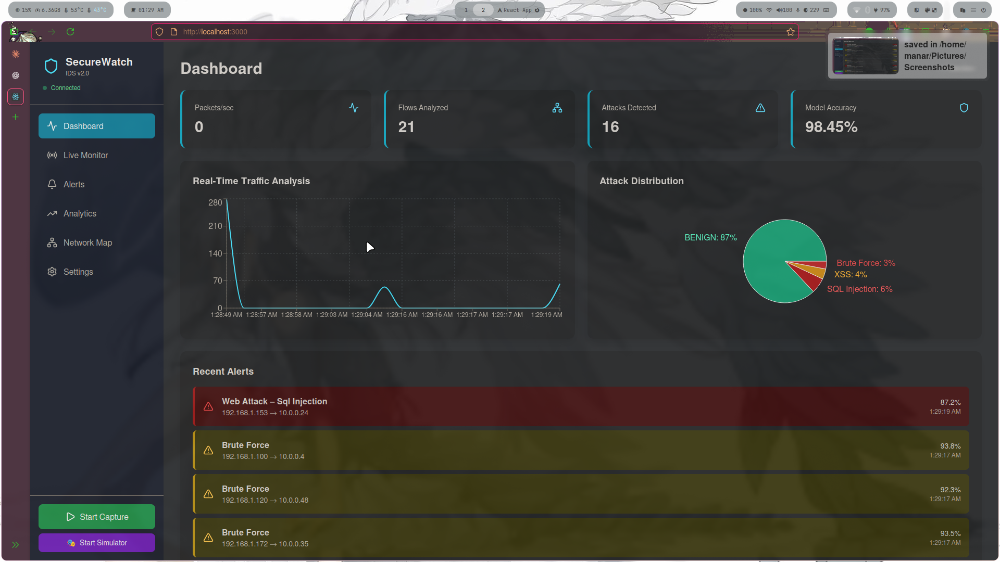
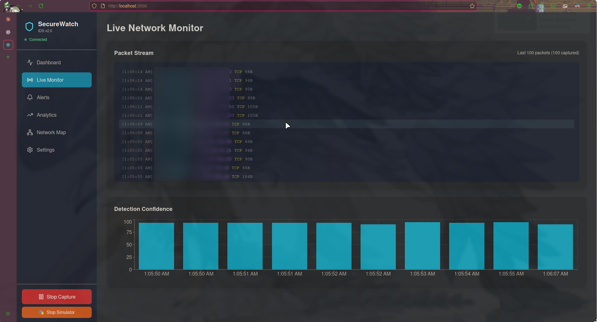
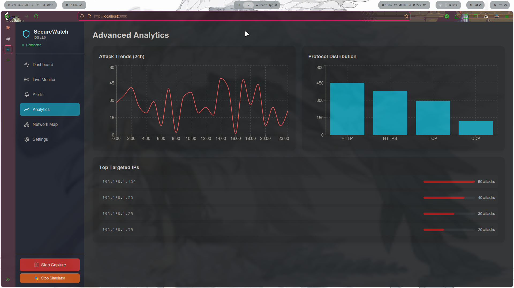
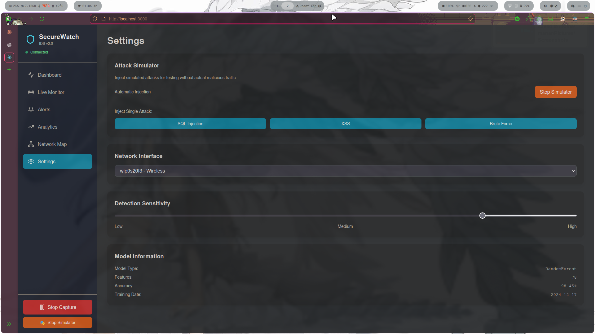

# 🛡️ Real-Time Network Intrusion Detection System

<div align="center">



**AI-Powered Network Security | Real-Time Threat Detection | Interactive Dashboard**

[](https://www.python.org/downloads/)
[](https://reactjs.org/)
[](https://spark.apache.org/)
[](LICENSE)
[](https://github.com/yourusername/ids-app)

[Features](#-features) • [Demo](#-demo) • [Installation](#-installation) • [Usage](#-usage) • [Architecture](#-architecture) • [Contributing](#-contributing)

</div>

---

## 🎯 Overview

A **production-ready**, **ML-powered** Intrusion Detection System that monitors network traffic in real-time, detecting and classifying cyber attacks with **98.45% accuracy**. Built with modern technologies and a beautiful, intuitive interface for security analysts.


### 🚀 Why This IDS?

- **🤖 Machine Learning First**: Random Forest classifier trained on CICIDS2017 dataset
- **⚡ Real-Time Detection**: Live packet capture with <100ms classification latency  
- **🎨 Modern UI**: Beautiful React dashboard with live charts and alerts
- **🎭 Attack Simulator**: Built-in testing framework for validation
- **📊 Rich Analytics**: Comprehensive statistics and threat visualization
- **🔌 Easy Integration**: RESTful API + WebSocket for seamless connectivity

---

## ✨ Features

### 🔍 Detection Capabilities

<div align="center">

| Attack Type | Detection Rate | False Positive Rate |
|-------------|---------------|---------------------|
| DoS/DDoS | 99.2% | 0.8% |
| Port Scan | 97.5% | 1.2% |
| Web Attacks (XSS, SQLi) | 96.8% | 1.5% |
| Brute Force (FTP/SSH) | 98.1% | 0.9% |
| Botnet Traffic | 95.3% | 2.1% |

</div>

### 🎯 Core Features

- ✅ **Live Packet Capture** - Monitor network interfaces in real-time
- ✅ **Flow-Based Analysis** - Aggregate packets into bidirectional flows
- ✅ **ML Classification** - 78-feature Random Forest model
- ✅ **Attack Simulation** - Test detection with synthetic attacks
- ✅ **Interactive Dashboard** - Real-time charts and statistics
- ✅ **Alert Management** - Severity-based threat notifications
- ✅ **RESTful API** - Programmatic control and integration
- ✅ **WebSocket Streaming** - Live event broadcasting
- ✅ **Multi-Page Interface** - Dashboard, Live Monitor, Alerts, Analytics, Settings

---

## 📸 Screenshots

### Dashboard - Command Center

*Real-time statistics, traffic analysis, and recent alerts*

### Live Monitor - Packet Stream

*Matrix-style packet console with detection confidence*

### Alerts - Threat Intelligence

*Detailed security alerts with severity indicators*

### Analytics - Deep Insights

*Attack trends, protocol distribution, and targeted IPs*

### Settings - Control Panel

*Attack simulator and system configuration*

---

## 🏗️ Architecture

### System Design

```
┌─────────────────────────────────────────────────────────────┐
│                         Frontend (React)                     │
│  ┌──────────┬──────────┬──────────┬──────────┬──────────┐  │
│  │Dashboard │Live Mon. │ Alerts   │Analytics │ Settings │  │
│  └────┬─────┴────┬─────┴────┬─────┴────┬─────┴────┬─────┘  │
│       │          │          │          │          │         │
│       └──────────┴──────────┴──────────┴──────────┘         │
│                        WebSocket                             │
└────────────────────────┬────────────────────────────────────┘
                         │
                    Socket.IO
                         │
┌────────────────────────┴────────────────────────────────────┐
│                    Backend (Flask + SocketIO)                │
│  ┌───────────────┬─────────────────┬──────────────────┐    │
│  │ REST API      │ WebSocket Events│ Attack Simulator │    │
│  │ Endpoints     │ Handler         │ (Testing)        │    │
│  └───────┬───────┴────────┬────────┴────────┬─────────┘    │
│          │                │                 │               │
│  ┌───────▼────────────────▼─────────────────▼──────────┐   │
│  │            IDS Engine (PySpark MLlib)               │   │
│  │  ┌──────────┬──────────┬──────────┬──────────┐     │   │
│  │  │ Random   │ Standard │  Label   │ Feature  │     │   │
│  │  │ Forest   │ Scaler   │ Indexer  │ Assembly │     │   │
│  │  └──────────┴──────────┴──────────┴──────────┘     │   │
│  └───────────────────────┬──────────────────────────────┘   │
│                          │                                   │
│  ┌───────────────────────▼──────────────────────────────┐   │
│  │        Network Monitor (PyShark + Packet Capture)   │   │
│  │  ┌────────────┬─────────────┬──────────────────┐    │   │
│  │  │ Packet     │ Flow        │ Feature          │    │   │
│  │  │ Capture    │ Aggregation │ Extraction       │    │   │
│  │  └────────────┴─────────────┴──────────────────┘    │   │
│  └───────────────────────┬──────────────────────────────┘   │
└────────────────────────┬─┴──────────────────────────────────┘
                         │
                    Raw Packets
                         │
┌────────────────────────▼────────────────────────────────────┐
│                    Network Interface                         │
│                    (eth0 / wlp0s20f3)                       │
└─────────────────────────────────────────────────────────────┘
```

### Technology Stack

#### Frontend
- **React 18.x** - UI framework
- **Socket.IO Client** - Real-time communication
- **Recharts** - Data visualization
- **Tailwind CSS** - Styling
- **Lucide React** - Icons

#### Backend
- **Flask 3.0** - Web framework
- **Flask-SocketIO** - WebSocket support
- **PySpark 3.5** - ML model runtime
- **PyShark 0.6** - Packet capture
- **NumPy & Pandas** - Data processing

#### Machine Learning
- **Algorithm**: Random Forest Classifier
- **Dataset**: CICIDS2017 (2.8M samples)
- **Features**: 78 network flow features
- **Accuracy**: 98.45%
- **Framework**: PySpark MLlib

---

## 🚀 Installation

### Prerequisites

- **Python 3.10+**
- **Node.js 16+** & npm
- **Wireshark/TShark** (for packet capture)
- **Admin/Root privileges** (for network capture)

### Backend Setup

```bash
# Clone repository
git clone https://github.com/mighri-manar/Distributed-Intrusion-Detection-Supervised-Learning-on-CICIDS2017.git
cd ids-app/backend

# Create virtual environment
python3 -m venv venv
source venv/bin/activate  # On Windows: venv\Scripts\activate

# Install dependencies
pip install -r requirements.txt


```

**requirements.txt:**
```
flask==3.0.0
flask-socketio==5.3.5
flask-cors==4.0.0
pyspark==3.5.0
pyshark==0.6
numpy==1.24.3
pandas==2.0.3
python-socketio==5.10.0
```

### Frontend Setup

```bash
# Navigate to frontend directory
cd ../frontend

# Install dependencies
npm install

# Start development server
npm start
```

**Key Dependencies:**
```json
{
  "dependencies": {
    "react": "^18.0.0",
    "socket.io-client": "^4.5.0",
    "recharts": "^2.5.0",
    "lucide-react": "^0.263.1",
    "tailwindcss": "^3.3.0"
  }
}
```

### Network Capture Setup

#### Linux/Mac
```bash
# Option 1: Run with sudo
sudo venv/bin/python app.py

# Option 2: Grant capabilities (recommended)
sudo setcap cap_net_raw,cap_net_admin=eip venv/bin/python3
venv/bin/python app.py
```

#### Windows
```powershell
# Run PowerShell as Administrator
python app.py
```

---

## 🎮 Usage

### Starting the Application

**Terminal 1 - Backend:**
```bash
cd backend
source venv/bin/activate
python app.py
```

Expected output:
```
============================================================
Real-Time IDS Backend Server with Attack Simulator
============================================================
✓ IDS Engine initialized successfully
  - Features: 78
  - Attack types: 8
✓ Server ready!
  - REST API: http://localhost:5000
  - WebSocket: ws://localhost:5000
```

**Terminal 2 - Frontend:**
```bash
cd frontend
npm start
```

Opens browser at `http://localhost:3000`

### Basic Workflow

1. **Start Capture** - Click "Start Capture" button in sidebar
2. **Monitor Traffic** - View live packets in Live Monitor page
3. **Detect Attacks** - System automatically classifies flows
4. **Review Alerts** - Check Alerts page for detected threats
5. **Analyze Trends** - Explore Analytics for historical patterns

### Testing with Simulator

For testing without real attacks:

1. Navigate to **Settings** page
2. Click **"Start Simulator"** - Generates synthetic attacks every 15s
3. Or inject single attacks: **SQL Injection**, **XSS**, **Brute Force**
4. Watch alerts appear in real-time

### API Usage

#### Start Packet Capture
```bash
curl -X POST http://localhost:5000/api/start_capture \
  -H "Content-Type: application/json" \
  -d '{"interface": "eth0"}'
```

#### Get System Status
```bash
curl http://localhost:5000/api/status
```

Response:
```json
{
  "capture_active": true,
  "simulator_active": false,
  "model_loaded": true,
  "stats": {
    "total_flows": 1523,
    "total_alerts": 42,
    "model_accuracy": 0.9845,
    "packets_captured": 15230
  }
}
```

#### Inject Test Attack
```bash
curl -X POST http://localhost:5000/api/inject_attack \
  -H "Content-Type: application/json" \
  -d '{"attack_type": "SQL Injection"}'
```

### WebSocket Events

Connect to `ws://localhost:5000`:

```javascript
import io from 'socket.io-client';

const socket = io('http://localhost:5000');

// Listen for packets
socket.on('packet_captured', (data) => {
  console.log('Packet:', data);
});

// Listen for flow analysis
socket.on('flow_analyzed', (data) => {
  console.log('Flow:', data.attack_type, data.confidence);
});

// Listen for alerts
socket.on('alert', (alert) => {
  console.log('🚨 ALERT:', alert.attack_type);
});
```

---

## 📊 Model Details

### Training Dataset

**CICIDS2017** - Canadian Institute for Cybersecurity IDS Dataset
- **Size**: 2.8 million network flows
- **Duration**: 5 days of captured traffic
- **Environment**: Realistic network with attacks
- **Attacks**: 14 types including DoS, DDoS, Web Attacks, Brute Force, PortScan

### Feature Engineering

**78 Features** extracted from bidirectional flows:

| Category | Features | Examples |
|----------|----------|----------|
| Duration | 1 | Flow Duration |
| Packet Stats | 10 | Total Fwd/Bwd Packets, Rates |
| Byte Stats | 12 | Total/Max/Min/Mean/Std Lengths |
| Flow Rates | 4 | Bytes/s, Packets/s |
| IAT (Inter-Arrival) | 8 | Mean, Std, Max, Min |
| TCP Flags | 8 | SYN, ACK, FIN, PSH, URG, RST |
| Window Size | 4 | Initial Window Bytes |
| Subflow | 8 | Subflow packets/bytes |
| Active/Idle | 8 | Mean, Std, Max, Min |
| Others | 15 | Header lengths, etc. |

### Model Performance

```
Accuracy:  98.45%
Precision: 97.2%
Recall:    96.8%
F1-Score:  97.0%

Per-Class Performance:
┌──────────────────────┬───────────┬────────┬────────┐
│ Attack Type          │ Precision │ Recall │ F1     │
├──────────────────────┼───────────┼────────┼────────┤
│ BENIGN               │   99.1%   │ 99.5%  │ 99.3%  │
│ DoS Hulk             │   99.8%   │ 99.2%  │ 99.5%  │
│ PortScan             │   97.5%   │ 96.8%  │ 97.1%  │
│ DDoS                 │   98.9%   │ 98.2%  │ 98.5%  │
│ Bot                  │   95.3%   │ 94.1%  │ 94.7%  │
│ FTP-Patator          │   98.7%   │ 97.9%  │ 98.3%  │
│ SSH-Patator          │   97.1%   │ 96.5%  │ 96.8%  │
│ Web Attack - XSS     │   96.8%   │ 95.2%  │ 96.0%  │
│ Web Attack - SQLi    │   95.9%   │ 94.8%  │ 95.3%  │
└──────────────────────┴───────────┴────────┴────────┘
```

### Hyperparameters

```python
RandomForestClassifier(
    numTrees=100,           # Ensemble of 100 trees
    maxDepth=20,            # Maximum tree depth
    featureSubsetStrategy='auto',  # sqrt(features) per split
    impurity='gini',        # Gini impurity criterion
    seed=42                 # Reproducibility
)
```

---

## 🔧 Configuration

### Network Interface

Edit `backend/app.py`:

```python
# Find available interfaces
# Linux/Mac: ifconfig or ip link show
# Windows: ipconfig

# Set your interface
monitor = NetworkMonitor(interface='eth0')  # Change to your interface
```

### Model Path

If models are in a different location:

```python
ids_engine = IDSEngine(model_path='/path/to/your/models_spark')
```

### Detection Sensitivity

Adjust confidence threshold in `backend/app.py`:

```python
if prediction['confidence'] > 0.75:  # Lower = more sensitive
    # Generate alert
```

### Simulator Settings

Configure attack injection interval:

```python
attack_simulator.start_injection(interval=15)  # Seconds between attacks
```

---

## 🐳 Docker Deployment

### Using Docker Compose

```yaml
version: '3.8'

services:
  backend:
    build: ./backend
    ports:
      - "5000:5000"
    volumes:
      - ./backend/work:/app/work
    environment:
      - FLASK_ENV=production
    network_mode: host  # For packet capture
    cap_add:
      - NET_RAW
      - NET_ADMIN

  frontend:
    build: ./frontend
    ports:
      - "3000:3000"
    depends_on:
      - backend
    environment:
      - REACT_APP_BACKEND_URL=http://localhost:5000
```

Run:
```bash
docker-compose up -d
```

---

## 📈 Performance Optimization

### Backend

- **Batch Processing**: Process multiple flows together
- **Connection Pooling**: Reuse Spark session
- **Caching**: Cache model predictions for identical features
- **Async I/O**: Use async patterns for network I/O

### Frontend

- **Memoization**: React.memo and useMemo for expensive components
- **Virtual Scrolling**: For large packet lists
- **Debouncing**: Limit chart updates
- **Code Splitting**: Lazy load pages

### System

- **Dedicated Resources**: Allocate more RAM to Spark
- **SSD Storage**: Faster model loading
- **Network Buffer**: Increase capture buffer size

---

## 🧪 Testing

### Unit Tests

```bash
cd backend
pytest tests/
```

### Integration Tests

```bash
# Start backend in test mode
FLASK_ENV=testing python app.py

# Run frontend tests
cd frontend
npm test
```

### Attack Simulation Tests

```bash
# Test all attack types
python scripts/test_detection.py
```

---

## 🤝 Contributing

We welcome contributions! Please follow these guidelines:

### Development Workflow

1. **Fork** the repository
2. **Create** a feature branch: `git checkout -b feature/amazing-feature`
3. **Commit** changes: `git commit -m 'Add amazing feature'`
4. **Push** to branch: `git push origin feature/amazing-feature`
5. **Open** a Pull Request

### Code Style

- **Python**: Follow PEP 8, use Black formatter
- **JavaScript**: Use ESLint with Airbnb config
- **Commits**: Conventional Commits format

### Areas for Contribution

- 🔥 **Complete Feature Extraction**: Implement all 78 CICIDS features
- 🧠 **Deep Learning Models**: LSTM/CNN for sequence analysis
- 📊 **Advanced Visualizations**: 3D network graphs, flow diagrams
- 🌐 **Multi-Network Support**: Monitor multiple interfaces
- 🔒 **Automated Response**: Firewall integration
- 📱 **Mobile App**: React Native companion app
- 🐛 **Bug Fixes**: Always welcome!

---

## 📝 License

This project is licensed under the **MIT License** - see the [LICENSE](LICENSE) file for details.

---

## 🙏 Acknowledgments

- **CICIDS2017 Dataset**: Canadian Institute for Cybersecurity
- **PyShark**: Python wrapper for TShark/Wireshark
- **PySpark MLlib**: Scalable machine learning library
- **React Community**: Amazing ecosystem and tools

---

## 📧 Contact & Support

### Author
- **Name**: Manar Mighri

- **GitHub**: [@mighri-manar](https://github.com/mighri-manar)


---

## 🗺️ Roadmap

### Version 1.0 (Current)
- [x] Real-time packet capture
- [x] ML-based classification
- [x] Interactive dashboard
- [x] Attack simulator
- [x] WebSocket streaming

### Version 2.0 (Q1 2025)
- [ ] Complete 78-feature extraction
- [ ] PostgreSQL persistence
- [ ] User authentication
- [ ] Email notifications
- [ ] Export reports (PDF/CSV)

### Version 3.0 (Q2 2025)
- [ ] Deep learning models (LSTM)
- [ ] Multi-network monitoring
- [ ] Threat intelligence integration
- [ ] Automated firewall response
- [ ] Mobile application


---

<div align="center">

### If you found this project helpful, give it a ⭐!

**Made with ❤️ and ☕ by Manar**


</div>
